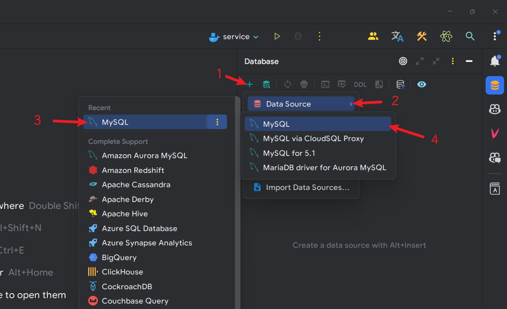
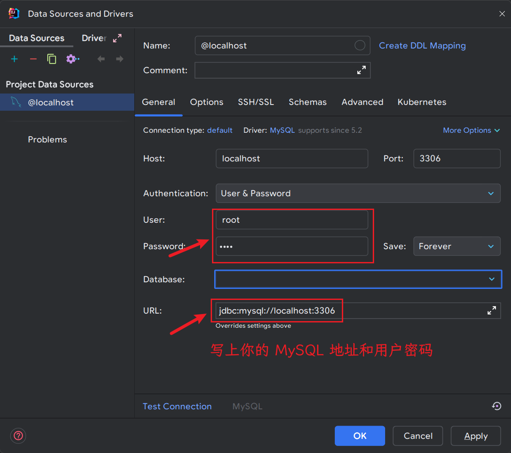
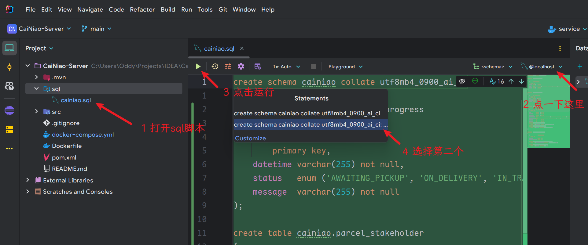
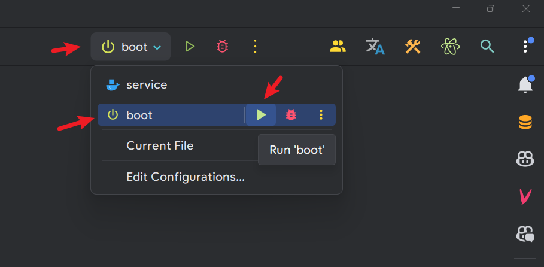

# CaiNiao-Server

[菜鸟 App](https://gitee.com/SeagullOddy/cai-niao) 的后端。

## 使用

1. 填入本仓库下载地址 `https://gitee.com/SeagullOddy/cai-niao-server.git`
   后点击克隆/clone

   

2. 在 `application.yml` 中修改数据库连接配置

   

3. 运行 `cainiao.sql`，创建数据库和数据表

   
   
   

4. 启动 Spring Boot

   

5. 完成！
